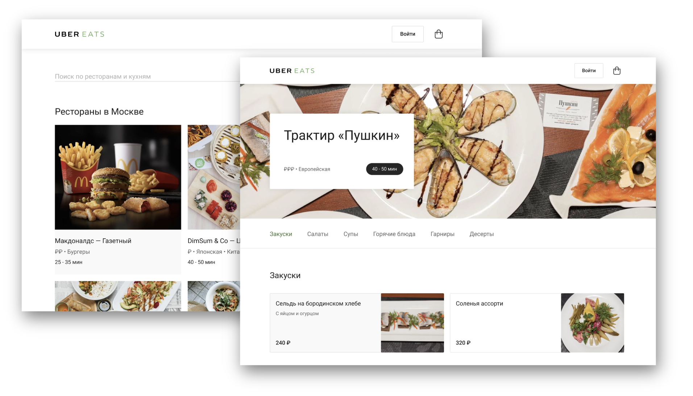
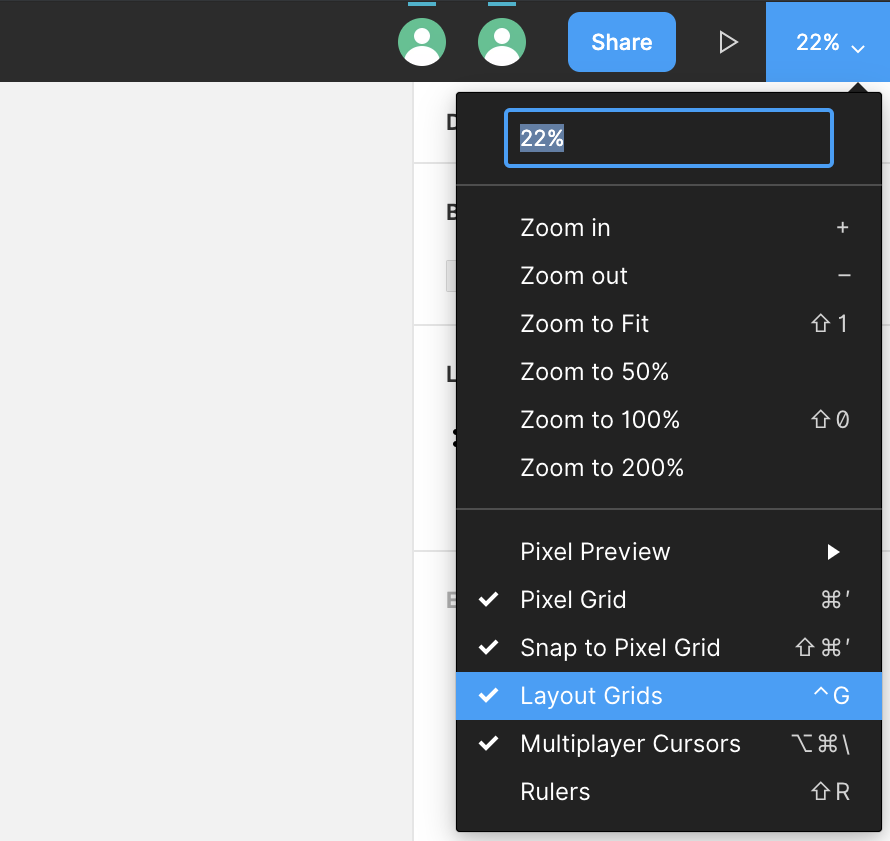
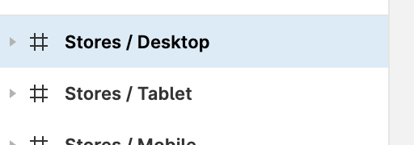
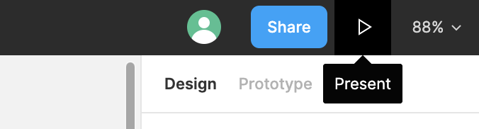

# Выпускной проект

Пора приниматься за самый сложный и крутой макет в курсе. Мы сверстаем сайт Uber Eats, состоящий из двух страниц – списка ресторанов и страницы ресторана. Страницы связаны друг с другом ссылками – клик по любому ресторану из списка переносит на страницу с рестораном «Пушкин».

[Макет в Фигме](https://www.figma.com/file/8lxQ3PGYTHQsCgTXnEJre8/Uber-Eats)

# Сетка

Используй CSS-сетку flexboxgrid2. Чтобы её подключить, просто добавь этот код в head:

    <link rel="stylesheet" href="https://unpkg.com/flexboxgrid2@7.2.1/flexboxgrid2.min.css">

[Документация по flexboxgrid2](https://evgenyrodionov.github.io/flexboxgrid2/)

# Перед началом (важно)

Войди в свой аккаунт в Фигме. Так ты сможешь смотреть параметры элементов, кликая на них.

## Сетка

В правом верхнем углу включи отображение сетки:

Или можешь использовать сочетание клавиш:

    Control + G на Mac
    Ctrl + Shift + 4 на Windows

## Фиксированные элементы

Кликни на любой фрейм в панели слева:

В правом верхнем углу экрана нажми Present. Промотай страницу вниз и вверх – увидишь элементы с position fixed.

